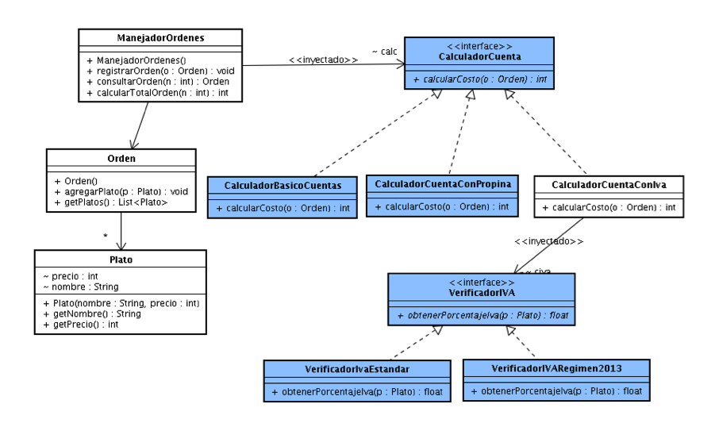

### Escuela Colombiana de Ingeniería

### Arquitecturas de Software


#### API REST adaptable para el cálculo de cuentas de restaurantes.

En este proyecto se va a construír un API REST que permita calcular el valor total de una cuenta de restaurante, teniendo en cuenta las políticas y regímenes tributarios configurados para la misma.

Este API será soportado por el siguiente modelo de clases, el cual considera el principio de inversión de dependencias, y asume el uso de Inyección de dependencias:




El anterior modelo considera, por ahora, los siguientes casos (la aplicación podrá configurarse de acuerdo con el restaurante donde sea usado):

* En algunos restaurantes los precios de los platos ya incluyen el IVA (CalculadorBasicoCuentas).
* En otros restaurantes los precios ya incluyen el IVA, pero sí cobran el servicio del 10% sobre el total de la factura (CalculadorCuentaConPropina).
* En muchos otros se cobra el IVA, pero de dos maneras diferentes:
	* 16% estándar sobre todos los platos (CalcularodCuentaConIVA + VerificadorIVAEstandar).
	* Aplicando un IVA diferencial al tipo de plato, previendo el régimen especial de impuestos a las comidas del el año 2013, donde las bebidas gaseosas tendrán un gravamen de sólo el 10%, y los demás platos del 17% (CalcularodCuentaConIVA + VerificadorIVARegimen2013).


Por defecto, el manejador de órdenes tiene dos órdenes registradas:

* Orden 0:

	| Producto        | Precio           | 
| ------------- |:-------------:| 
|pizza|$7500|
|gaseosa|$3900|
|hamburguesa|$8000|
|gaseosa 350|$200|

* Orden 1:

	| Producto        | Precio           | 
| ------------- |:-------------:| 		
|pizza|$7500|
|pizza|$7500|
|pizza|$7500|
|gaseosa litro|$4000|


### Parte I

1. Configure su aplicación para que ofrezca el recurso "/ordenes", de manera que cuando se le haga una petición GET, retorne -en formato jSON- el listado de todas las órdenes. Para esto:
	* Modifique la clase CuentaResourceController teniendo en cuenta el siguiente ejemplo de controlador REST hecho con SpringMVC/SpringBoot:

	```java
@RestController
@RequestMapping(value = "/url-raiz-recurso")
public class XXController {
    
        
    @RequestMapping(method = RequestMethod.GET)
    public ResponseEntity<?> manejadorGetRecursoXX(){
        try {
            //obtener datos que se enviarán a través del API
            return new ResponseEntity<>(data,HttpStatus.ACCEPTED);
        } catch (XXException ex) {
            Logger.getLogger(XXController.class.getName()).log(Level.SEVERE, null, ex);
            return new ResponseEntity<>("Error bla bla bla",HttpStatus.NOT_FOUND);
        }        
}

	```
	* Haga que en esta misma clase se inyecte el bean de tipo ManejadorOrdenes, y que a éste -a su vez-, se le inyecte el bean CalculadorBasicoCuentas. Para esto, revise en [la documentación de Spring](http://docs.spring.io/spring/docs/current/spring-framework-reference/html/beans.html) las secciones 7.9.2 y 7.10.3, respecto a cómo declarar Beans, y cómo definir la inyección de dependencias entre éstos, mediante anotaciones.

2. Verifique el funcionamiento de a aplicación lanzando la aplicación con maven:

	```bash
	$ mvn spring-boot:run
	
	```
	Y luego enviando una petición GET a: http://localhost:8080/ordenes. Rectifique que, como respuesta, se obtenga un objeto jSON con una lista que contenga las dos órdenes disponibles por defecto.


3. Modifique el controlador para que ahora, adicionalmente, acepte peticiones GET al recurso /orden/{idorden}, donde {idorden} es el número de una orden en particular. En este caso, la respuesta debe ser la orden indicada en formato jSON. Para esto, revise en [la documentación de Spring](http://docs.spring.io/spring/docs/current/spring-framework-reference/html/mvc.html), sección 22.3.2, el uso de @PathVariable. De nuevo, verifique que al hacer una petición GET -por ejemplo- a recurso http://localhost:8080/ordenes/0, se obtenga en formato jSON el detalle correspondiente.


###Parte II

1.  Agregue el manejo de peticiones POST (creación de nuevas ordenes), de manera que un cliente http pueda registrar una nueva orden haciendo una petición POST al recurso ‘ordenes’, y enviando como contenido de la petición todo el detalle de dicho recurso a través de un documento jSON. Para esto, tenga en cuenta el siguiente ejemplo, que considera -por consistencia con el protocolo HTTP- el manejo de códigos de estados HTTP (en caso de éxito o error):

	```	
@RequestMapping(method = RequestMethod.POST)	
	public ResponseEntity<?> manejadorPostRecursoXX(@RequestBody TipoXX o){
        try {
            //registrar dato
            return new ResponseEntity<>(HttpStatus.CREATED);
        } catch (XXException ex) {
            Logger.getLogger(XXController.class.getName()).log(Level.SEVERE, null, ex);
            return new ResponseEntity<>("Error bla bla bla",HttpStatus.FORBIDDEN);            
        }        
 	
	}
	```	


2.  Para probar que el recurso ‘ordenes’ acepta e interpreta
    correctamente las peticiones POST, use el comando curl de Unix. Este
    comando tiene como parámetro el tipo de contenido manejado (en este
    caso jSON), y el ‘cuerpo del mensaje’ que irá con la petición, lo
    cual en este caso debe ser un documento jSON equivalente a la clase
    Cliente (donde en lugar de {ObjetoJSON}, se usará un objeto jSON correspondiente a una nueva orden:

	```	
	$ curl -i -X POST -HContent-Type:application/json -HAccept:application/json http://URL_del_recurso_ordenes -d '{ObjetoJSON}'
	```	

	Con lo anterior, registre una nueva orden:


	| Producto        | Precio           | 
	| ------------- |:-------------:| 
	|hamburguesa|$8000|
	|hamburguesa|$8000|		
	|postre de natas|$5000|


3. Verifique qué identificador fue asignado al recurso anteriormente creado, y que el mismo se pueda obtener mediante una petición GET al recurso '/ordenes/{idorden}' correspondiente.


###Parte III

4. Haga lo necesario para que ahora el API acepte peticiones al recurso '/ordenes/{idorden}/total, las cuales retornen el total de la cuenta de la orden {idorden}.

5. Una vez hecho esto, rectifique que el esquema de inyección de dependencias funcione correctamente. Cambie la configuración para que ahora se use el CalculadorCuenta con IVA, con el VerificadorIVARegimen2013. Compruebe que para las ordenes 0 y 1 se calcule el total de forma diferente.
